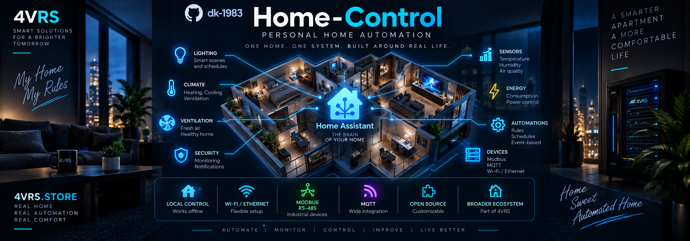

# Home Control

Личный проект автоматизации конкретной квартиры на Home Assistant, созданный под мои предпочтения, оборудование и повседневные привычки. **Made for myself.**

Этот репозиторий отражает мои сценарии и выбранные для них решения; универсальность и поддержка произвольных установок не являются целью проекта. Код можно изучать и адаптировать по MIT-лицензии.

Реализация оформлена как собственная интеграция с локальными процессами и будущей координацией всей квартиры. Первый процесс — управление четырьмя группами люстры в зале одной кнопкой.

Версия: **0.3.0**. Лицензия: [MIT](LICENSE).

## Что реализовано

- Управление одной–четырьмя сущностями `switch` в заданном порядке.
- Физическая кнопка Tasmota через существующую интеграцию MQTT.
- Включение и выключение выбранного ночника `light` или `switch` по длительному нажатию `HOLD` в том же процессе.
- Собственная сущность `button` и необязательная существующая `input_button`.
- Отдельный сохраняемый переключатель **«Автоматика»** для каждого процесса.
- Настройка и изменение параметров через интерфейс Home Assistant, переводы RU/EN.
- Последовательная обработка нажатий, независимая от задержек обновления реле.
- Проверка обратной связи, диагностические атрибуты и выгружаемая диагностика.
- Несколько независимых экземпляров; запрет повторного назначения групп и источников кнопок.

Глобальные сценарии, вентиляция, увлажнение и климат в эту версию не входят.

## Совместимость

Целевая установка: **Home Assistant Core 2026.9.3**. Выполнены **59 тестов**, включая загрузку и выгрузку сущностей с реальным Core 2026.9.3, фиктивным транспортом MQTT и тестовыми сервисами реле. Проверка с реальной Tasmota ещё требуется.

Нужны настроенная интеграция MQTT и от одной до четырёх существующих сущностей `switch`. Интеграция не настраивает прошивку Tasmota и не хранит реквизиты брокера.

## Установка

1. Скопируйте каталог `custom_components/home_control` в `/config/custom_components/home_control` вашей установки Home Assistant.
2. Перезапустите Home Assistant.
3. Откройте **Настройки → Устройства и службы → Добавить интеграцию → Home Control**.
4. Задайте название процесса, от одной до четырёх групп в порядке выключения, MQTT-топик и ключ кнопки. При необходимости выберите существующую `input_button`.
5. Отключите прежний pyscript и YAML-автоматизации на этих же событиях.
6. Откройте созданное устройство и включите переключатель **«Автоматика»**.

После первой установки автоматика **выключена**. Точные `entity_id` новых сущностей формируются Home Assistant; смотрите их на странице устройства. Для нового помещения добавьте ещё один экземпляр интеграции.

### Обновление с 0.1.0

Замените каталог `/config/custom_components/home_control` новой версией и полностью перезапустите Home Assistant. В версии 0.1.0 ошибочно использовался тип `helper`, из-за чего Home Control попадал в список помощников. В 0.1.1 установлен тип `service`: добавление и управление выполняются во вкладке **Интеграции**. Уже созданную запись удалять не нужно; её параметры и состояние переключателя сохраняются. Если список в браузере не обновился, перезагрузите страницу.

### Параметры

| Поле | Значение |
| --- | --- |
| Группа 1 | Обязательная сущность `switch`, выключается первой |
| Группы 2–4 | Необязательные разные сущности `switch`; пустые поля пропускаются |
| MQTT-топик | Точный топик Tasmota `RESULT`, без `+` и `#` |
| Ключ кнопки | По умолчанию `Button4` |
| Ночник | Необязательная сущность `light` или `switch`; переключение по `HOLD` |
| Существующая input_button | Необязательно; собственная `button` создаётся всегда |
| Окно выбора | По умолчанию 3 секунды, диапазон 0,2–30 |
| Ожидание обратной связи | По умолчанию 5 секунд, диапазон 1–60 |

Пример сообщения: `{"Button4":{"Action":"SINGLE"}}`. Пробелы и дополнительные поля допустимы. `HOLD` переключает настроенный ночник. `CLEAR`, многократные нажатия, повреждённый JSON и retained-сообщения игнорируются. Подписка использует QoS 0; Tasmota должна публиковать события кнопки без retain.

Для изменения параметров используйте настройки интеграции. Сохранение перезагружает процесс и сбрасывает цикл без переключения света. Чтобы убрать прежнюю `input_button`, очистите это необязательное поле.

## Ночник по длительному нажатию

После обновления файлов интеграции и полного перезапуска Home Assistant откройте настройки существующего процесса и выберите поле **«Ночник (light или switch) — переключение по HOLD»**. Новую запись создавать не нужно. Поддерживаются лампы `light.*` и реле/розетки `switch.*`, независимо от производителя. Старые записи без этого поля продолжают работать как раньше. Уже настроенные ночники `light.*` сохраняются.

- `SINGLE` управляет группами люстры.
- Каждый `HOLD` переключает ночник: выключенный включает через `turn_on`, включённый выключает через `turn_off` соответствующего домена (`light` или `switch`).
- Для быстрых повторных удержаний временно учитывается ожидаемое состояние лампы. Оно сбрасывается при совпадении с состоянием HA, истечении настроенного ожидания обратной связи, ошибке команды или отключении процесса. После этого используется состояние HA.
- Яркость, цвет и эффект не задаются; сохраняется поведение самой лампы при включении.
- `CLEAR` игнорируется. Виртуальные кнопки остаются источниками короткого нажатия.
- Удержание не переключает люстру и не продлевает её окно выбора.
- Общий переключатель «Автоматика» блокирует оба действия. Ночник и люстра используют одну очередь команд.
- Недоступность или ошибка ночника записывается как `night_light_command_failed` и не блокирует последующие короткие нажатия. Отдельный контроль обратной связи ночника пока не реализован; успех означает завершение вызова сервиса.

Tasmota должна самостоятельно распознавать удержание и публиковать `{"Button4":{"Action":"HOLD"}}`. После включения распознавания удержания проверьте быстрые клики: Tasmota может объединять их в `DOUBLE`, которое эта версия не обрабатывает.

## Алгоритм

`1` — группа включена, `0` — выключена. Порядок соответствует заполненным полям групп 1–4. Первая группа обязательна, остальные можно оставить пустыми или очистить в настройках существующей записи. Пропуски допустимы: например, группы 1 и 3 работают как две последовательные группы. Старые записи с четырьмя группами сохраняют своё поведение.

```text
1 группа:  0 → 1 → 0 → 1 ...
2 группы: 00 → 11 → 01 → 00 → 11 ...
3 группы: 000 → 111 → 011 → 001 → 000 → 111 ...
4 группы: 0000 → 1111 → 0111 → 0011 → 0001 → 0000 → 1111 ...
```

- Когда всё выключено, нажатие включает все группы.
- Нажатие в пределах окна, включая точную границу 3 секунд, выключает следующую группу. Каждое обработанное нажатие обновляет окно от времени прихода события.
- После завершения цикла короткое ожидаемое состояние «все группы выключены» сохраняется, чтобы быстрое новое нажатие корректно включало свет даже при запаздывающей обратной связи.
- За пределами окна, если свет включён, нажатие выключает все группы.
- Во время активного цикла используется ожидаемое состояние; внешнее переключение отдельных реле не меняет порядок выбора. После цикла контроллер возвращается к состояниям Home Assistant. До истечения тайм-аута обратной связи может использоваться ещё неподтверждённая последняя команда.
- После перезапуска или повторного включения автоматики цикл пуст. Первое нажатие при включённой любой группе выключает всё.

## Переключатель обслуживания

У каждого процесса есть собственный переключатель **«Автоматика»**:

- **Включён:** процесс принимает нажатия.
- **Выключен:** MQTT, собственная `button` и существующая `input_button` не запускают процесс; цикл и ожидающие нажатия сбрасываются.
- Переключение автоматики само по себе не включает и не выключает реле.
- Состояние хранится через Home Assistant Store и восстанавливается после перезапуска и перезагрузки интеграции.
- При включении пропущенные нажатия не воспроизводятся.

Уже переданную оборудованию команду нельзя отозвать. Выключение ожидает завершения текущего вызова сервиса, который ограничен 10 секундами. Независимые правила Tasmota, другие автоматизации и прямое управление реле этим переключателем не отключаются. Он останавливает именно данный процесс, а не обесточивает оборудование.

## Ошибки и диагностика

При `unknown`, `unavailable` или отсутствии любой группы нажатие игнорируется, цикл сбрасывается. Исключение/тайм-аут сервиса тоже сбрасывает цикл и отменяет уже ожидающие нажатия. Повторных автоматических команд нет.

Успешный вызов сервиса означает передачу команды, а не подтверждение реле. По истечении тайм-аута проверяется последнее ожидаемое состояние всех настроенных групп. Несовпадение записывается как `feedback_timeout`; цикл сбрасывается без корректирующего переключения. Следующее нажатие использует доступные состояния Home Assistant. Обратная связь HA не является измерением электрического выхода реле.

Атрибуты переключателя:

| Атрибут | Значение |
| --- | --- |
| `process_type` | `local_chandelier` |
| `selection_step` | Число оставшихся включёнными групп в активном цикле: 0–N, иначе `null` |
| `expected_states` | Ожидаемый неподтверждённый результат, иначе `null` |
| `last_error` | Последняя ошибка или `null` |
| `last_source` | `mqtt`, `mqtt_hold`, `input_button` или `button` |

Коды ошибок: `unavailable_group`, `command_failed`, `command_cancelled`, `feedback_timeout`, `stale_press`, `storage_failed`, `night_light_command_failed`. Нажатия, пробывшие в очереди более 10 секунд, не воспроизводятся. При ошибке сохранения переключатель остаётся выключенным в текущем процессе, вызов сообщает об ошибке; сохранение нового состояния после перезапуска в этом случае не гарантируется.

В меню интеграции можно скачать диагностику. Идентификаторы групп и ночника, MQTT-топик и `input_button` в ней скрыты.

## Разработка

Для локальных проверок нужен Python 3.14.

```powershell
python -m unittest discover -s tests -v
python -m pip install ruff==0.15.7
ruff check .
ruff format --check .
```

Без установленного Home Assistant выполняются 27 независимых тестов, а тесты HA пропускаются. С Home Assistant Core 2026.9.3 и `paho-mqtt==2.1.0` выполняются также 32 проверки MQTT-адаптера, сервисов, хранения переключателя, событий, настройки и сущностей. Все временные тестовые файлы находятся в игнорируемом `work/`.

Структура и правила расширения: [docs/architecture.md](docs/architecture.md). Изменения: [CHANGELOG.md](CHANGELOG.md).
